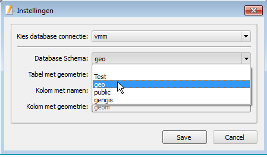
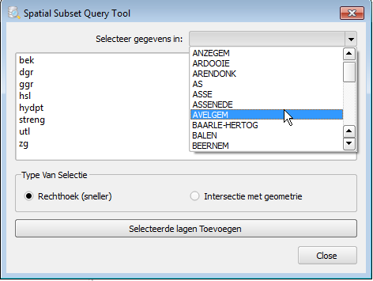

Spatial Subset Query tool
====

A python plugin for QGIS.
Make a spatial query that selects a subset from a dataset based on the intersection with a dataset from an other preselected dataset in the same database.
This can be needed if you have a larger database. This way you can only load the region of interest you need and you avoid loading to much data. 
This is confusing for the user and requires more resources from the dataabase and client. 

**Remark:** Needs to be configured before it can be used.

Configuration:
------------

A python Plugin for QGIS.

Before you can use this tool you need to have to add one or more connections to a postgis databases to QGIS.
You can find infomation about this here: http://docs.qgis.org/2.8/en/docs/user_manual/working_with_vector/supported_data.html#postgis-layers 
and even more here: http://docs.qgis.org/2.8/en/docs/training_manual/database_concepts/index.html

If have a database connection you can configure the tool:
Click on settings button on the toolbar: 

1. First choose a existing database connection from the top list.
2. Then select the schema for the list below.
3. After selecting the schema you can select a table with a geometry-column form where the the intersecting geometry will be pulled.
4. Then select the column that contains the names or some other identifying feature of the dataset. In the tool all the unique values in this column will be shown.
5. The geometry column is selected automatically, click save.  

Usage:
-----

After configuration you can use the tool to load a subset of a spatial table in you database.

Click the query-icon to show the dialog.    

1. From dropdown on the right hand side, choose a name/value where want select al the intersecting data from.
2. Then select datasets you want to add to the map.
3. You choose to add all the data intersecting the bounding or the full geometry of the row at the selected value in the dropdown.
4. Then click "Add Selected Layers" to add to the map.

----
A tool developed for the Flemish Environment Agency (Vlaamse Milieu Maatschappij, [VMM](https://www.vmm.be/)).

By Kay Warrie (kaywarrie@gmail.com)
