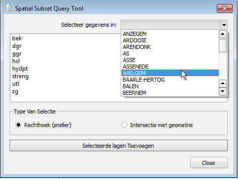

Spatial Subset Query tool
====

Een python plugin voor QGIS.

Maak ruimtelijke query die een subset van een dataset selecteert op basis van de intersectie met een andere laag bij een bepaald waarde.
Dit kan nodig zijn als u een grotere database heeft.
Op deze manier kunt u alleen de laag laden binnen het gebied dat voor u van belang is en voorkomt u dat te veel gegevens laad.
Dat is verwarrend voor de gebruiker en vereist meer resources van de database en client.

**Opmerking:** Je moet de tool eerst configureren voor je hem kan gebruiken.

Configuratie:
------------

Voor u deze tool kan instellen moet u al 1 of meerdere postgis database connecties in QGIS hebben.
U kan hiervoor meer informatie vinden in QGIS handleiding, hier: http://docs.qgis.org/2.8/nl/docs/user_manual/working_with_vector/supported_data.html#postgis-layers 
en hier: http://docs.qgis.org/2.8/nl/docs/training_manual/database_concepts/index.html

Wanneer je een bestaande database connectie hebt:
Klik de instellingen icoon, om de dialoog te openen: 

1. Eerst kies een bestaande database connectie uit de lijst.
2. Daarna selecteer het schema.
3. Daarna kies een database tabel met een geometrie kolom, die begrenzingen waarbinnen je gegevens wilt selecteren.
4. Daarna selecteer de kolom die de namen (of een andere identificeerde waarde) van de begrenzingen bevat.
5. De geometrie kolom wordt automatisch geselecteerd, klik op save.  

Gebruik:
-----

Na configuratie kan je de tool gebruiken om een subset van je datalagen in te laden binnen de ingestelde begrenzingen.

Klik op het query icoon om de dieloog te openen.    

1. Uit de uitklaplijst in de rechterbovenhoek, kies de begrenzing.
2. Dan selecteer de gewenste lagen.
3. Je kunt kiezen om te selecteren binnen de rechthoek rond de begrenzing of binnen de geometrie van begrenzing zelf, dit kan wel iets trager zijn.
4. Klik op "Selecteerde lagen Toevoegen" om de lagen toe te voegen aan de kaart.

----
Dit is een tool ontwikkelt voor Vlaamse Milieu Maatschappij ([VMM](https://www.vmm.be/)).

Door Kay Warrie (kaywarrie@gmail.com)
